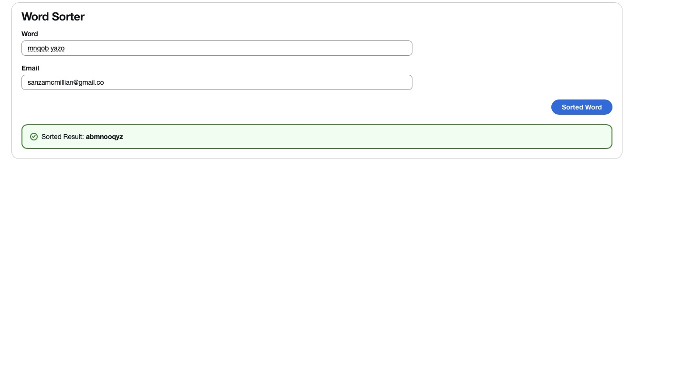

---
# Word Sorter

A full-stack application that sorts the letters of a word alphabetically. Built with **FastAPI** backend and a **React + Cloudscape** frontend.

---

## Features

- Input a word and an email
- Client-side validation:
  - Email must be valid
- Sends a POST request to the FastAPI backend
- Displays sorted result dynamically
- Responsive and modern UI with Cloudscape Design System

---

## Demo

[Live Link](https://word-sorter-frontend.onrender.com)  
[Backend API](https://converter-api-1t50.onrender.com)

---

## Tech Stack

**Frontend**:

- React (Vite)  
- Cloudscape Design System  
- Fetch API for async requests

**Backend**:

- FastAPI(python)  
- Pydantic validation

---

## Author
#### Sanele Skhosana